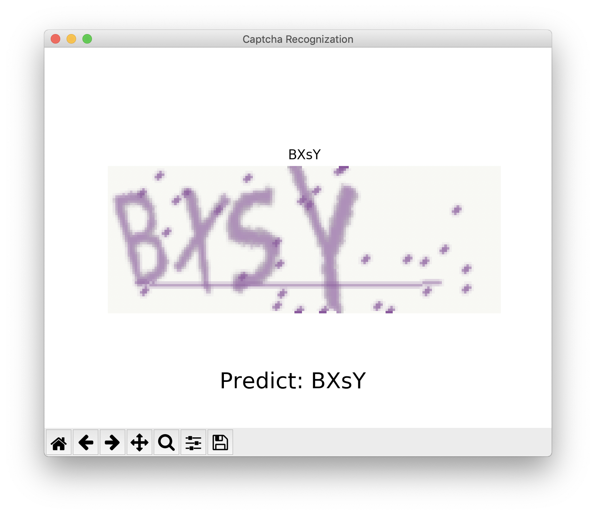
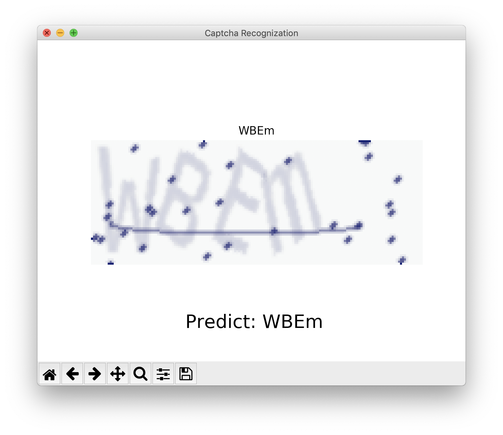
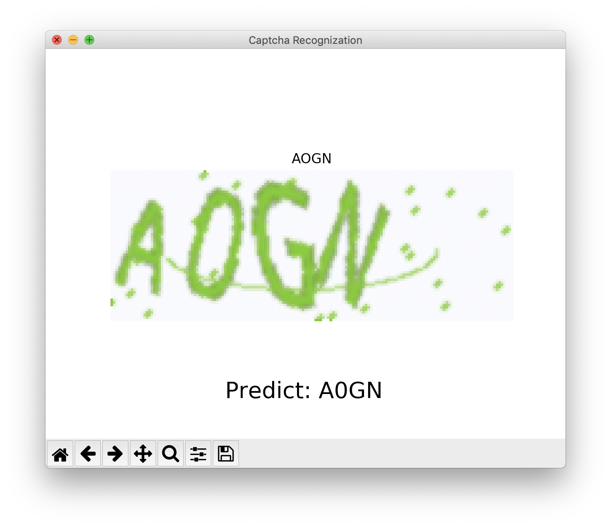

# 包括数字和字母的验证码识别


刚开始学习CNN时候根据MNIST识别的代码仿写了一个简单的验证码识别模型，由于训练太耗时时间有限，就只做了四位只有数字字符的验证码模型。

现在我修改了部分代码，字符包括数字和大小写字母了，也可以修改验证码的长度。并且训练好了一个四字符长度的验证码识别模型，准确率大概是0.93，测试发现除了个别情况（比如识别很相似的o、O和0这种情况，人眼也是分不出来的），基本能做到准确识别。


## 训练

[train](./src/captcha_recognization.py)

验证码生成用了一个库：

```bash
pip install captcha
```

```python
from captcha.image import ImageCaptcha
```

定义了一个五层的模型，最后两层为全连接层，前三层每层经过卷积、ReLU激活函数、max_pool池化，最后将输入映射到``CAPTCHA_SIZE*CHAR_CANDIDATES_SIZE``个输出，每``CHAR_CANDIDATES_SIZE``个值表示一位验证码字符，其中最大概率位表示的字符即是验证码该位置的输出字符。

其中由于图像的色彩对识别字符不起关键作用，因此将彩色图像转换为灰度图：

```python
r, g, b = img[:, :, 0], img[:, :, 1], img[:, :, 2]
gray = 0.2989 * r + 0.5870 * g + 0.1140 * b
gray = gray.reshape( 60, 160, 1 )
```

我用了50000条数据，用CPU训练耗时约为1000分钟，最终模型准确率约为0.93。


## 测试

github大文件比较麻烦，训练好的模型放在了[这里](https://pan.baidu.com/s/1D8L-NYpPKSF-GM0Cz_NkUA)。

将保存的模型导入：

```python
saver = tf.train.Saver()
saver.restore( sess, model_path )
```

具体代码为 [test](./src/captcha_recognization_test.py)，模型已经包括在目录中，可以直接运行。

对于人眼能识别的图像，基本能做到识别正确：





但是也有识别错误的情况（可是这个我也认不出来啊…这明明就是0啊！)：



